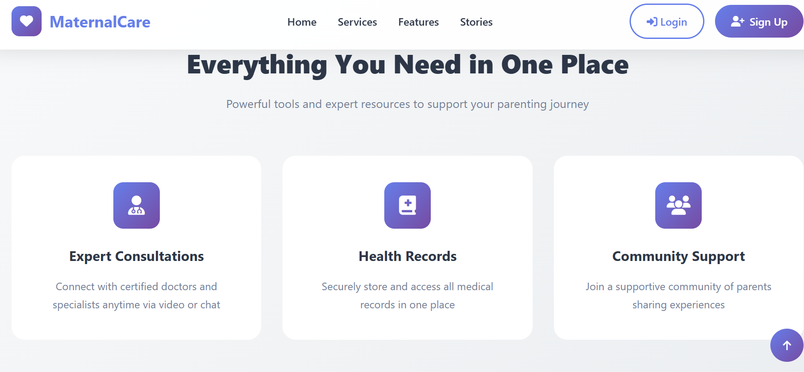
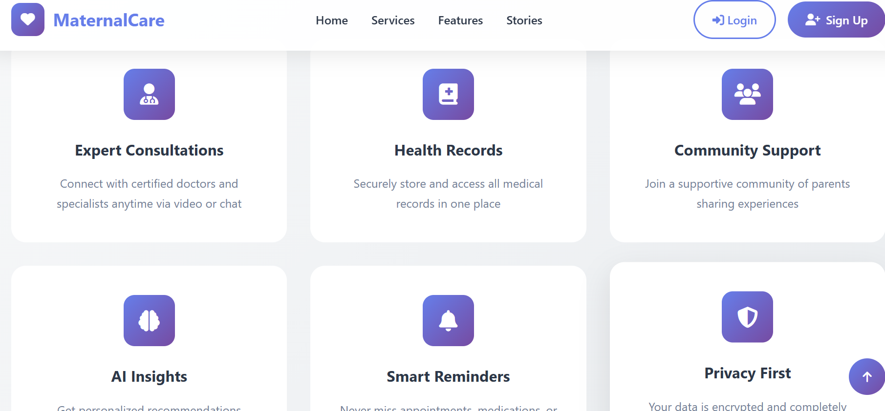

# MomCare 🤰🩺  
### Maternal and Child Health Monitoring System

MomCare is a comprehensive **web-based maternal and child healthcare management system** designed to support mothers, babies, doctors, and administrators through every stage of pregnancy and early childcare.  
The platform provides health tracking, medical scheduling, wellness resources, and AI-powered assistance in one unified system.

---

## ✨ Key Features

### 👩‍🍼 User Features (Mothers / Patients)
- Pregnancy progress tracking
- Baby growth monitoring
- Vaccination schedules & reminders
- Personalized nutrition plans
- Exercise & meditation resources
- AI-powered healthcare chatbot
- Access to government healthcare schemes
- FAQ-based health guidance

### 🩺 Doctor Dashboard
- View and manage appointments
- Access patient health records
- Generate and review medical reports

### 👨‍💻 Admin Dashboard
- User management (Admin, Doctor, Patient)
- Manage vaccinations, nutrition, exercises, meditation, and schemes
- FAQ and content management

---

## 🖼️ Screenshots

### Home / Landing Page


### User Dashboard & Features


### Healthcare & Baby Care Modules


---

## 🛠️ Technology Stack

- **Backend**: Flask (Python)
- **Database**: SQLAlchemy with SQLite
- **Frontend**: HTML, CSS, JavaScript
- **Charts & Visualization**: Chart.js
- **AI Module**: Chatbot-based health assistance
- **Email Service**: Notification & alerts

---

## 🚀 Quick Start Guide

### Prerequisites
- Python 3.8 or higher
- pip (Python package manager)

### Installation

1. Clone the repository:
```bash
git clone https://github.com/vaibhavipatil0241/MomCare.git
cd MomCare
Install dependencies:

bash

pip install -r requirements
Run the application:

bash

python run
Open your browser and visit:

cpp
Copy code
http://127.0.0.1:5000
📂 Project Structure
csharp

MomCare/
├── run                 # Application entry point
├── requirements        # Python dependencies
├── clear_database      # Database reset utility
├── README              # Project documentation
├── app/
│   ├── models/         # Database models
│   ├── routes/         # Application routes
│   ├── services/       # Business logic
│   ├── static/         # CSS, JS, images
│   ├── templates/      # HTML templates
│   └── utils/          # Helper utilities
└── instance/           # Instance-specific configuration
👥 User Roles
Admin: Full system access, user & content management

Doctor: Appointment handling, patient reports, consultations

Patient: Health tracking, baby care tools, resources, and chatbot support

🗄️ Database Management
To reset the database:

bash

python clear_database
⚙️ Configuration (Optional)
Create a .env file for custom settings:

env

FLASK_ENV=development
HOST=127.0.0.1
PORT=5000
SECRET_KEY=your-secret-key-here
